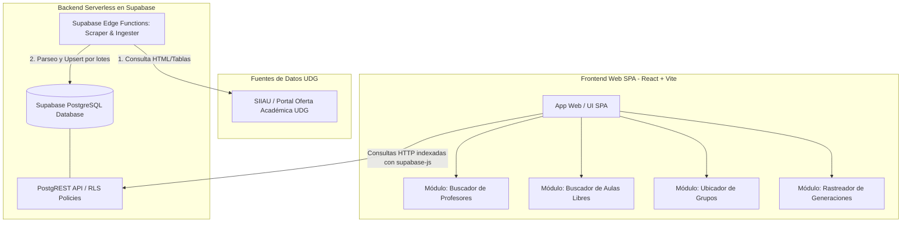
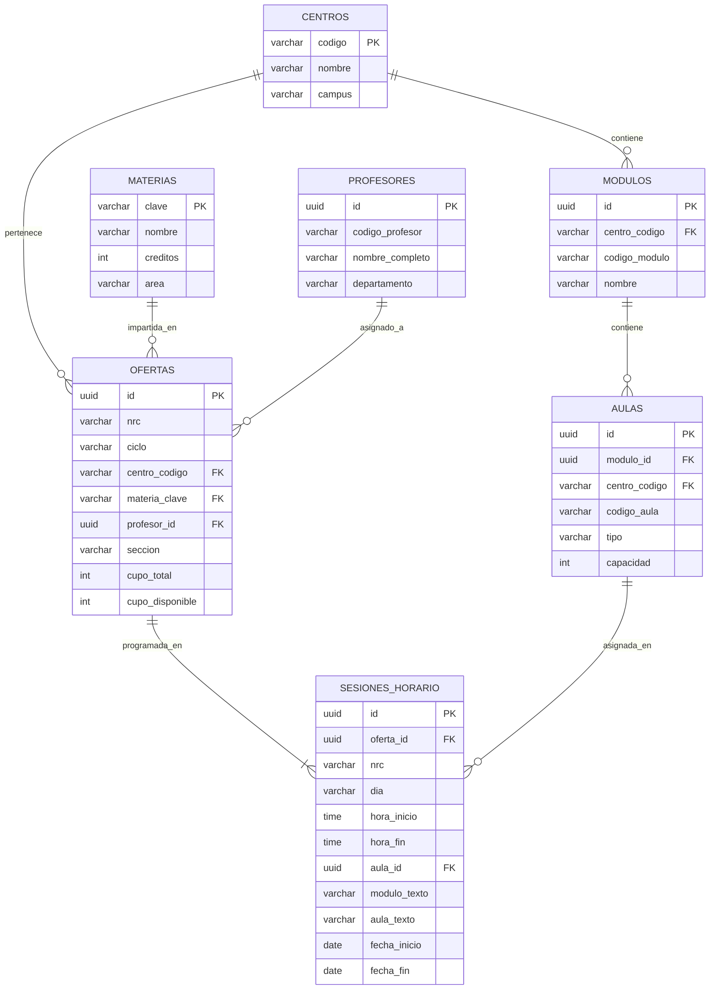

# Descripción General de la Arquitectura — Buscador UDG

## 1. Stack Tecnológico

| Componente | Tecnología | Detalle / Justificación |
|------------|-----------|-------------------------|
| **Frontend** | React 18 + Vite + TypeScript | SPA de alta velocidad, bundle liviano, despliegue estático |
| **Estilos & UI** | Tailwind CSS + Lucide Icons + Shadcn/Radix UI | Componentes accesibles, responsivos y modulares |
| **Backend & Base de Datos** | Supabase (PostgreSQL 15+) | Base de datos relacional serverless con PostgREST integrado |
| **Scraping / Ingesta** | Supabase Edge Functions (Deno / TS) + Cheerio | Extracción serverless y upsert por lotes de la oferta académica |
| **Hosting & CI/CD** | Vercel / Cloudflare Pages + GitHub Actions | Alojamiento en capa gratuita con despliegues atómicos |

---

## 2. Diagrama de Arquitectura de Alto Nivel

---

## 3. Modelo Relacional de Datos (ERD)

---

## 4. Estrategia de Búsqueda de Aulas Libres

Para determinar qué aulas están **libres** en un centro, módulo, día y rango horario específico $[H_{inicio}, H_{fin}]$:

1. **Aulas Ocupadas:**
   $$\text{AulasOcupadas} = \{ a \in \text{Aulas} \mid \exists s \in \text{Sesiones} : s.aula\_id = a.id \land s.dia = D \land (s.hora\_inicio < H_{fin} \land s.hora\_fin > H_{inicio}) \}$$
2. **Aulas Libres:**
   $$\text{AulasLibres} = \text{AulasDelModulo} \setminus \text{AulasOcupadas}$$
3. Se implementa mediante una función RPC en PostgreSQL (`get_free_classrooms(centro, modulo, dia, hora_ini, hora_fin)`) para ejecutar la diferencia de conjuntos directamente en base de datos con índices B-Tree en `(dia, hora_inicio, hora_fin)`.

---

## 5. Estrategia de Ingesta y Resiliencia

- **Particionamiento por Centro y Departamento:** Dado el límite de ejecución de Edge Functions (Free Tier: 50s-150s CPU time), la ingesta se ejecuta particionada por Centro Universitario y/o departamento/carrera.
- **Normalización de Texto:** Limpieza de nombres de profesores (eliminación de acentos, mayúsculas, espacios extra) para permitir búsquedas `ILIKE` o `trigram` (extensión `pg_trgm`).
- **Idempotencia:** Uso intensivo de `ON CONFLICT (ciclo, nrc) DO UPDATE` para permitir resincronizaciones sin duplicados.
